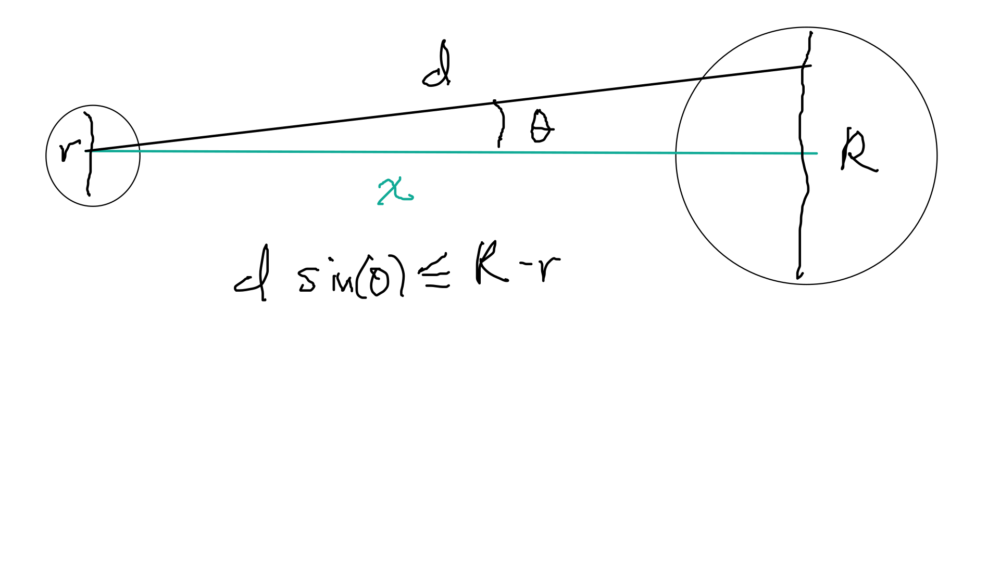

Este caso está basado en  @GelmanNolan y @GolfCase.
Usamos el flujo de trabajo bayesiano tomado del
documento de Michael Betancourt @BetancourtCase.


```{r}
library(cmdstanr)
library(posterior)
library(tidyverse)
source("../R/simular_resumenes.R")
```

## Problema

Queremos entender modelar la probabilidad de éxito de putts de Golf (putts: tiros
relativamente cerca del hoyo que buscan que la pelota ruede al hoyo o muy 
cerca de él), y cómo depende el éxito de la distancia del tiro. Quisiéramos
inferir qué tan precisos son los profesionales en sus tiros.

### Análisis conceptual

Podemos pensar en cada intento que hace un golfista como una prueba independiente
que puede resultar en éxito o fracaso. La probabilidad de éxito depende
de la distancia.

El diámetro de una pelota de golf y el hoyo (en centrímetos) es de

```{r}
diam_pelota <- (1.68 * 2.54) %>% round(1)
diam_hoyo <- (4.25 * 2.54) %>% round(1)
c(diam_pelota, diam_hoyo)
```

Supondremos por el momento que los greens de golf (áreas cerca del hoyo) 
son perfectamente planos (lo cual no es cierto, pero refinaremos después),
de modo que el éxito depende de tirar la pelota con un ángulo suficientemente cercano
a cero con
respecto a la línea que va del centro de la pelota al centro del hoyo.

Supongamos que la distancia del centro de la pelota al centro del hoyo es $x$, y que 
$\theta$ es el ángulo del tiro con respecto a la recta que va del centro de la pelota
al centro del hoyo. El tiro es exitoso cuando

$$\tan(\theta) < \frac{R - r}{2x}$$
Por simetría, sólo consideramos $\theta$ con valores positivos (aunque puede
ser que algunos golfistas tengan fallas asimétricas, eso lo discutimos más adelante).


En particular para nuestro problema, la condición de éxito es

$$\tan(\theta) < \frac{3.25}{x}$$

Mejores golfistas tendrán mejor control sobre $\theta > 0$, y conforme
$x$ es más grande, la probabilidad de tener éxito baja:

```{r}
tibble(x = seq(20, 500, 1)) %>% 
  mutate(theta = (180 / pi) * atan(3.25 / x)) %>% 
ggplot(aes(x, theta)) + geom_point() +
  xlab("Distancia (cm)") +
  ylab(expression(paste("Desviación máxima ", theta))) +
  labs(subtitle = "Desviación máxima permitida para tener éxito a distintas distancias")
```

Para nuestro modelo simplificado, la tasa de éxito dependerá de la 
distancia al hoyo, y del ángulo de cada tiro.
Algunas observaciones:

- No sabemos si con tiros más largos la desviación aumenta (son tiros más fuertes)
o si se mantiene constante. En principio supondremos que no existe un efecto importante
en este sentido. 

- Adicionalmente, puede ser que en tiros largos también haya fallos por distancia
que reduzcan la probabilidad de tener éxito, aunque el ángulo sea correcto. 

- Esta curva puede variar dependiendo del jugador, pero vamos a modelar el conjunto
de tiros de profesionales. Suponemos homogeneidad que podríamos checar con
datos desagregados por jugador. Estos datos podrían tener sobrerrepresentación
de tiradores malos (que quizá hacen más tiros).

- No estamos tomando en cuenta inclinación del *green*.


### Espacio de observaciones

Usaremos datos de tiros de profesionales que incluyen la distancia al hoyo
y si el tiro fue exitoso o no.

El espacio de observaciones que esperamos del tipo $(x, y)$ donde $x$ es la
distancia del putt y $y$ indica si se logró o no. Probablemente tendremos
los datos agregados: para cada distancia aproximada $x$ tendremos un conteo
de intentos y éxitos sobre los tiros de los jugadores profesionales.

```{bash}
sed -n '/^data/,/\}/p' ../stan/modelo.stan
```

### Estadísticas resumen

Consideraremos el porcentaje de éxitos para cada distancia dada en las observaciones
(cada cubeta de distancias) como resumen principal de interés. 

```{bash}
sed -n '/^transformed/,/\}/p' ../stan/modelo.stan
```

### Desarrollo del modelo

Consideraremos que las observaciones del número de éxitos $e(x)$ a una 
distancia de $x$ metros es

$$e(x) \sim \textrm{Binom}(n(x), p(x))$$
 La probabilidad de éxito depende de los ángulos
que se observen en los tiros. Empezamos poniendo

$$\theta \sim N^+(0,\sigma),$$
que expresa nuestra incertidumbre acerca de la desviación promedio $\theta$ que logran
los jugadores profesionales. La probabilidad de éxito es entonces

$$p(x) = P(\tan(\theta) < 3.25/x) = P(\theta < \arctan(3.25/x))$$
De modo que 
$$p(x) = P \left (Z^+ <  \frac{\arctan(3.25/x)}{\sigma}\right )$$
y entonces

$$p(x)= 2\Phi \left(\frac{\arctan(3.25/x)}{\sigma}\right ) - 1$$
donde $\Phi$ es la distribución acumulada de la normal estándar.

Ahora: no conocemos el valor de $\sigma$, así que tenemos que poner
alguna información acerca de este valor para el cual no tendremos mediciones.
En este punto es necesario consultar con algún experto.

Un experto nos informa que es raro los tiradores profesionales rara vez
exceden más de 4 grados a partir de la línea que quieren tirar, y sabemos
que la desviación promedio no puede ser muy cercana a cero, pues siempre
existen fallas, especialmente más allá de 1 metro de distancia. Una desviación estándar
de los tiros debería estar entre 0.5 y 2.5, por ejemplo. Por el momento
no consideramos que esto pueda variar en función de la distancia. Así que
ponemos 
$$\sigma \sim Gamma(a, b)$$
y tenemos que establecer $a,b$ de forma la mayor parte de la probabilidad
esté entre 0.1 grados y 3 grados de desviación

```{r, fig.width=4, fig.height=2.5}
set.seed(11882)
qplot((180 / pi) * rgamma(5000, 10, 500))
qgamma(c(0.01, 0.99), 10, 500) * (180/pi)
```


Hemos incluido información acerca del problema:

- El modelo de las observaciones y los mecanismos subyacentes
- Distribuciones iniciales consistentes con el conocimiento que tenemos acerca 
del proceso.

### Simular ensamble bayesiano

Ahora simulamos el ensamble bayesiano. Escogemos algunas distancias
en centímetros y un número de intentos a cada distancia. Esperamos
encontrar menos tiros a distancias más grandes. Si este fuera un experimento
diseñado, quizá tendríamos el número de intentos en cada distancia predefinidos.
Aunque no es ideal, en este caso pondremos algunos números de intentos y distancias hipotéticas
para probar nuestros modelos.

```{r}
sim_datos <- jsonlite::read_json("../datos/datos_prueba.json", simplifyVector = TRUE)
parametros <- jsonlite::read_json("../datos/datos_inicial.json", simplifyVector = TRUE)
print(sim_datos)
```


```{r}
sim_ensemble_datos <- c(sim_datos, parametros)
ruta <- file.path("../stan/simular_ensemble_modelo.stan")
modelo_inicial <- cmdstan_model(ruta)
ensemble <- simular_ensemble(modelo_inicial, sim_ensemble_datos)
```

Y examinamos las siguientes probabilidades de éxito:

```{r}
exitos_tbl <- curvas_exito(ensemble, sim_ensemble_datos)
 g_1 <- ggplot(exitos_tbl, aes(x = factor(x), y = prop_exitos)) +
    geom_jitter(alpha = 0.1) 
g_1
```

En este punto podemos consultar con el experto para verificar que:

- Pŕacticamente no consideramos realizaciones imposibles (por ejemplo, 100% de éxito para todas las distancias, 50% de éxitos para tiros de 50 cm, etc.)
- El espacio de realizaciones cubre apropiadamente el rango de posibilidades
que el experto considera factible.

### Ajustar al ensemble simulado

Ahora probamos ajustar el modelo a las simulaciones. En este paso tenemos
qué checar qué puede pasar incluso con las condiciones más extremas 
que creemos que podemos encontrar. 

Podemos probar con una simulación:

```{r}
num_iter <- 11
exitos_sim <- ensemble$draws("exitos")
sigma_sim_tbl <- ensemble$draws(c("sigma")) %>% as_draws_df()
```


```{r}
ruta <- file.path("../stan/modelo.stan")
modelo <- cmdstan_model(ruta)
```


```{r, message=FALSE, warning=FALSE}
datos_1 <- c(sim_ensemble_datos, list("exitos_obs" = exitos_sim[num_iter, 1, ] %>% as.numeric))
ajuste <- ajustar_modelo(modelo, datos_1, iter_sampling=2000)
```

```{r}
ajuste$cmdstan_diagnose()
```

Este ajuste corrió sin problemas. Recuperamos los parámetros $\beta$ para esta simulación:

```{r}
ajuste_draw <- ajuste$draws(c("sigma")) %>% as_draws_df
ggplot(ajuste_draw, aes(x = sigma)) + geom_histogram() +
  geom_vline(data = sigma_sim_tbl[num_iter, ], aes(xintercept = sigma), colour = "red",2)
```
En este caso, el resultado es consistente con la simulación. Es necesario repetir esto varias
veces para entender si estamos recuperando o no los parámetros de interés.

### Calibración algorítmica

Ahora veremos si el algoritmo corre sin problemas numéricos con los supuestos
del ensamble inicial. Es necesario repetir con muchas simulaciones, para
entender si algunas configuraciones pueden tener dificultades numéricas.

```{r, warning = FALSE, message = FALSE, include = FALSE}
ajustes_ensemble <- 
  map(1:100, ~ ajustar_diagnosticos(.x, 
        modelo = modelo, 
        datos = c(sim_ensemble_datos, list("exitos_obs" = exitos_sim[.x, 1, ] %>% as.numeric)),
        params = sigma_sim_tbl[.x, ] %>% select(-.chain, -.iteration, -.draw) )) %>% 
  bind_rows()
```

Vemos que algunas corridas tuvieron errores:

```{r}
map(ajustes_ensemble$diagnosticos, "stdout") %>% str_detect("no problems detected") %>% all()
```


### Calibración inferencial

Ahora checamos que recuperamos los parámetros apropiadamente:

```{r}
sbc_rank_sim <- ajustes_ensemble %>% select(sbc_rank) %>% unnest
ggplot(sbc_rank_sim, aes(sample = sigma)) +
  geom_qq(distribution = stats::qunif) +
  geom_qq_line(distribution = stats::qunif)
```

La distribución del ranking de las simulaciones con relación a cada parámetro
simulado es cercana a la uniforme, pero existen algunas desviaciones.

